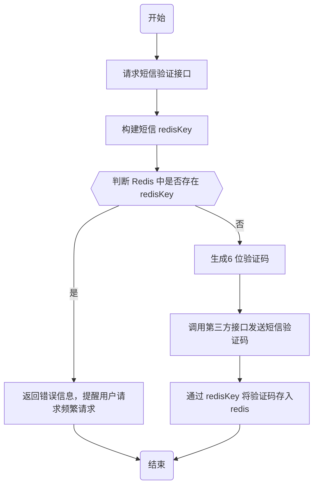
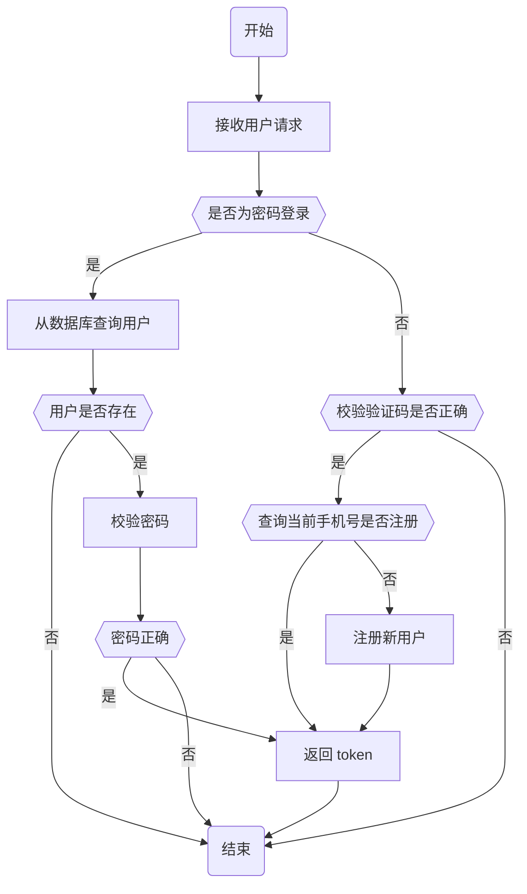
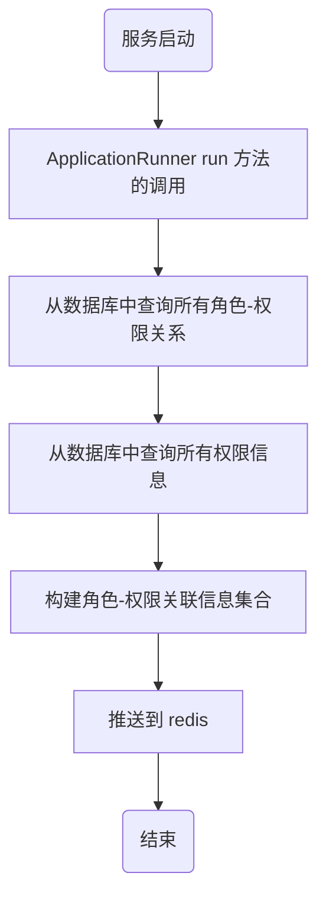

# AUTH 
## 发送验证码
### 入参
```json
{
    "phone": "1387027644"
}
```
### 响应参数
```json
{
    "success": true,
    "message": null,
    "errorCode": null,
    "data": null
}
```


### 流程图

## 登录与注册
### 入参
```json
{
    "phone": "13870276442", 
    "code": "119903", 
    "password": "xx", 
    "type": 1 
}
```

### 响应参数
```json
{
	"success": true,
	"message": null,
	"errorCode": null,
	"data": "xxxxx" 
}

```



## 同步角色-权限信息

